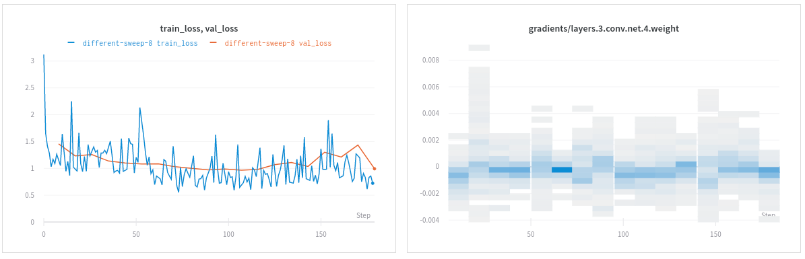
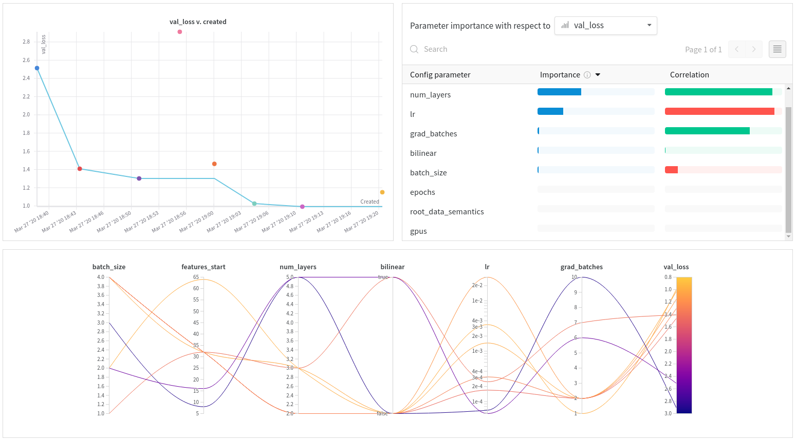

# Lightning Kitti

*Semantic Segmentation with Pytorch-Lightning*

## Introduction

This is a simple demo for performing semantic segmentation on the [Kitti dataset](http://www.cvlibs.net/datasets/kitti/eval_semseg.php) using [Pytorch-Lightning](https://pytorch-lightning.readthedocs.io/) and optimizing the neural network by monitoring and comparing runs with [Weights & Biases](https://docs.wandb.com/).

Hyper-parameters are defined pseudo-randomly and every run is automatically logged onto [Weights & Biases](https://www.wandb.com/) for easier analysis/interpretation of results and how to optimize the architecture.

You can also run [sweeps](https://docs.wandb.com/sweeps/) to optimize automatically hyper-parameters.

*Note*: this example has been adapted from Pytorch-Lightning examples.

## Usage

1. Install dependencies through `requirements.txt`, `Pipfile` or manually (Pytorch, Pytorch-Lightning & Wandb)
2. Log in or sign up for an account -> `wandb login`
3. Run `python train.py`
4. Visualize and compare your runs through generated link

   

## Sweeps

1. Run `wandb sweep sweep.yaml`
2. Run `wandb agent <sweep_id>` where `<sweep_id>` is given by previous command
3. Visualize and compare the sweep runs

   

## Results

After running the script a few times, you will be able to compare quickly a large combination of hyperparameters.

Feel free to modify the script and define your own hyperparameters.

[See the live report → ](https://app.wandb.ai/borisd13/lightning-kitti/reports/Lightning-Kitti--Vmlldzo3MTcyMw).
